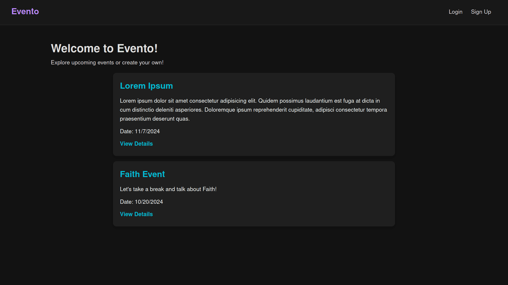
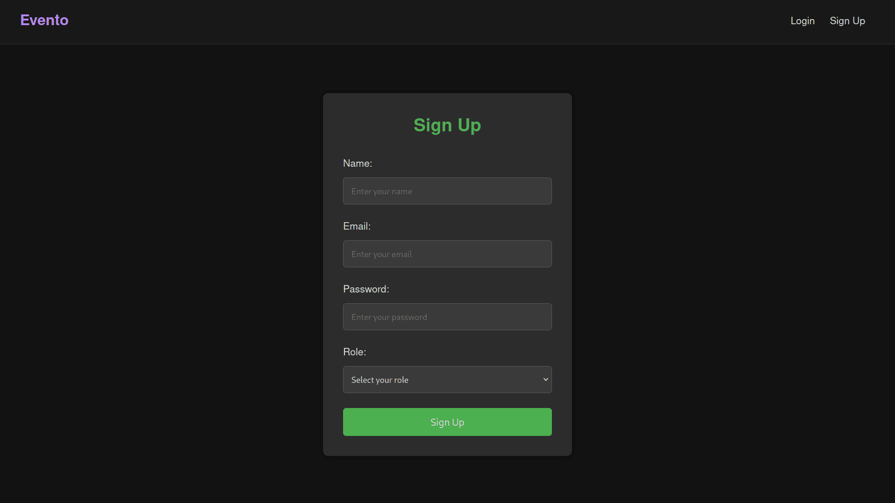
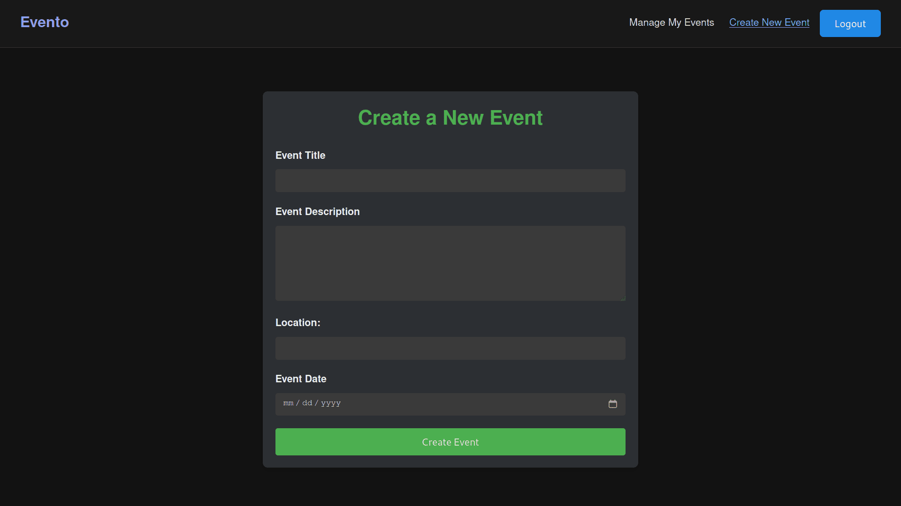

# Event Planning and Ticketing Platform

## Overview

This project is an **Event Planning and Ticketing Platform** designed to allow users to create, manage, and participate in events. The platform offers functionalities for **event organizers** to manage event listings, track attendees, and mark attendance, while providing **attendees** the ability to register for events, view upcoming events, and access past events. The project uses the **MERN stack (MongoDB, Express, React, Node.js)** for full-stack development.

## Technology Stack

The project uses the following technologies:

### Frontend:
- **Next.js**: For server-side rendering and efficient page routing.
- **React.js**: For building dynamic user interfaces.
- **CSS Modules**: For modular and scoped styling.

### Backend:
- **Node.js**
- **Express.js**
- **JWT (JSON Web Tokens)**

### Database:
- **MongoDB**: For managing data related to users, events, and registrations.

### Additional Tools:
- **Mongoose**: For object data modeling (ODM) to interact with MongoDB.
- **CSV Export**: For exporting event attendance lists in CSV format.
- **Bcrypt**: For password hashing and security.

## Installation

Follow the steps below to install and run the project locally:

1. **Clone the repository**:
```bash
git clone https://github.com/ahmedzzyy/evento-io.git
```
2. **Navigate to the project directory**
```bash
cd evento-io
```
3. **Set up environment variables**
- Create a `.env` file in both `/frontend` and `/backend` directories (or in the root if using shared `.env`).
- Add the required variables such as `JWT_SECRET`, `MONGO_URI`, and `BASE_URL`.
4. **Run Docker Compose**
```bash
docker compose up --build
```
5. **Access the application**
- The frontend will be running on `http://localhost:3000`.
- The backend API will be accessible on `http://localhost:5500`.

## Sneak Peek

<details>
<summary>Images</summary>



</details>

## Features

### General Features:
1. **Authentication**: User registration and login system using **JWT-based authentication**. Both **attendees** and **organizers** have distinct roles within the system.
2. **Pagination and Search**: Efficient search functionality for users to browse events with pagination to ensure optimal user experience.

### Organizer Features:
1. **Create Events**: Organizers can create events, specifying details such as title, description, date, and location.
2. **Update/Delete Events**: Organizers have full control over editing or deleting events they created.
3. **Mark Attendance**: Organizers can mark attendees as present or absent for their events.
4. **Export Attendee List**: Organizers can download attendee lists in CSV format for event management purposes.

### Attendee Features:
1. **Register for Events**: Attendees can register for events and view their registration status.
2. **Cancel Event Registration**: Attendees can withdraw from events they’ve previously registered for.
3. **View Past Events**: Attendees can view events they’ve attended in the past and access event details.

## Conclusion
This project serves as a comprehensive, full-stack application demonstrating real-world use cases like event management, user roles, and secure authentication. It is a valuable addition to any portfolio, showcasing skills in frontend development, backend API creation, database management, and user authentication with JWT. 